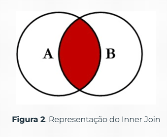
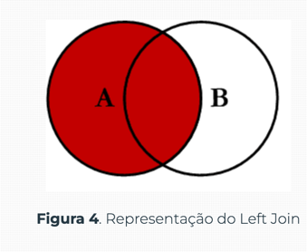
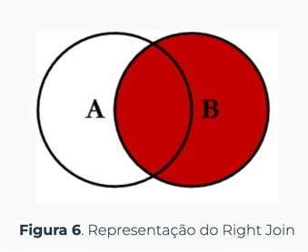
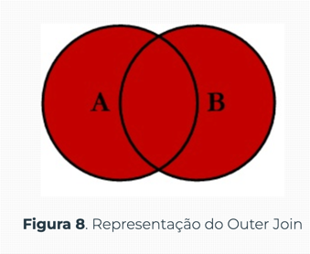
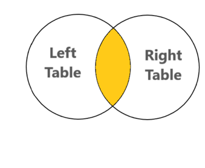
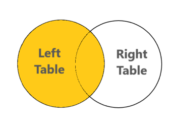

# Responda as seguintes questoes

## 1 - Como é chamado um **JOIN** em um banco de dados e pra que é usado?

> É utilizado para agregar os dados de duas ou mais tabelas da consulta
> 
> É chamado da seguinte forma:

```sql

SELECT t1.field, t2.field 
FROM tabela_1 t1 
    INNER JOIN tabela2 t2 ON tabela_1.field = tabela_2.field;
```

## 2 - Explique os tipos de **JOIN**

> __<u>INNER JOIN</u>__  
> O retorno é o que é comum entre as duas tabelas  
> 
> Na imagem:  
> 
> 
> __<u>LEFT JOIN</u>__  
> Retorna o que é comum entre as duas tabelas e os outros
> registros da tabela a esquerda
> mesmo que não estejam na tabela da direita.
> Na imagem:  
>   
> 
> <u>__RIGHT JOIN__</u>  
> Retorna o que é comum entre as duas tabelas e os outros
> registros da tabela a direita
> mesmo que não estejam na tabela da esquerda
> Na imgem:  
>   
> 
> <u>__OUTER JOIN__</u>  
> Retorna todos os registros da tabela da esquerda e da direita  
> Na imagem:  
> 

### 3 - Pra que serve o **GROUP BY**?
> O **GROUP BY** como o próprio nome já diz, agrupa o resultado da consulta
> de acordo com a coluna indicada, geralmente é utilizado em conjunto
> com as funções de agregação.
 
### 4 - Pra que serve o **HAVING**?
> O **HAVING** é igual ao **WHERE** porém ele é utilizado nos grupos
> obtidos pelo **GROUP BY**

### 5 - Escreva uma consulta genérica para cada um dos seguintes diagramas

  
```sql
SELECT left_table.field, right_table.field
FROM right_table
INNER JOIN left_table
    ON left_table.field = right_table.field
```

<br>


```sql
SELECT left_table.field, right_table.field
FROM left_table
LEFT JOIN righ_table
    ON left_table.field = righ_table.field
```