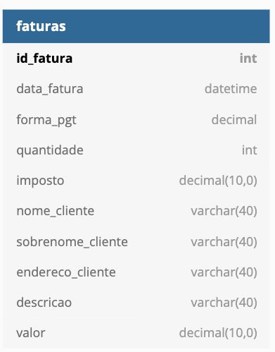
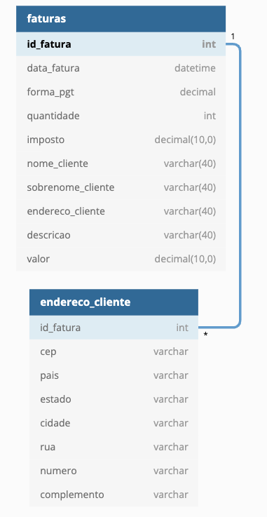
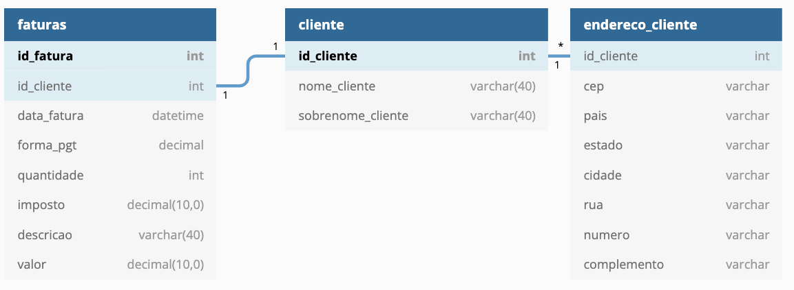
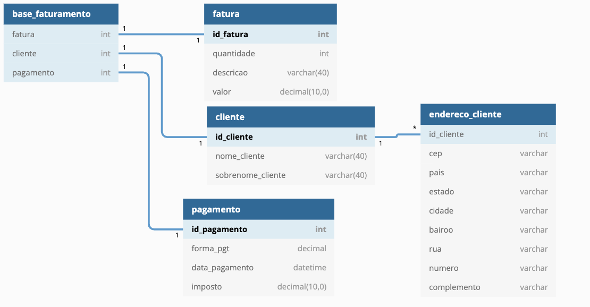

## Database inicial

## Normalização

## Aplicando primeira forma normal (1FN)

> Na Primeira Forma Normal, os dados duplicados nos atributos são removidos e são criados
> registros separados.   
> A regra da Primeira Forma Normal estabelece que colunas repetidas devem ser removidas e
> colocadas em tabelas separadas, respeitando a atomicidade dos dados.  
> Uma relação está na primeira forma normal se e somente se satisfaz que seus
> domínios simples têm apenas valores atômicos, isto é, se todos os seus atributos são atômicos.

- Nota-se que um cliente pode ter mais de um endereço, portanto, este campo será separado.

### 1FN

## Aplicando segunda forma normal (2FN)

> Na Segunda Forma Normal, as colunas que não dependem da chave primária são descartadas.  
> A regra da segunda forma normal afirma que todas as dependências parciais devem ser removidas
> e separadas em suas próprias tabelas.   
> Uma relação está na 2FN se, e somente se, estiver na 1FN e todos os atributos não-chave
> forem completamente dependentes da chave.

- Nota-se que o cliente pode ter sua própria tabela, pois nem todos os dados do cliente são dependentes do id da fatura

### 2FN

## Aplicando terceira forma normal (3FN)

> Exclua subgrupos de dados em várias colunas de uma tabela e crie novas tabelas, 
> com relacionamentos entre elas.  
> Uma relação está na 3FN se, e somente se, estiver na 2FN e cada atributo não-chave 
> depender da chave primária de forma não transitiva.  
> Quando as tabelas estão na Terceira Forma Normal, os erros de lógica são evitados quando 
> os registros são inseridos ou excluídos.  
> Cada coluna em uma tabela é identificada exclusivamente pela chave primária e não deve haver dados 
> duplicados. Isso fornece uma modelagem limpa e elegante que é fácil de trabalhar e expandir.

- Nota-se que os dados referentes a pagamento podem ser extraídos para uma tabela
- Também pode ser criado uma base de faturamento, apenas referenciando os dados da fatura

### 3FN
